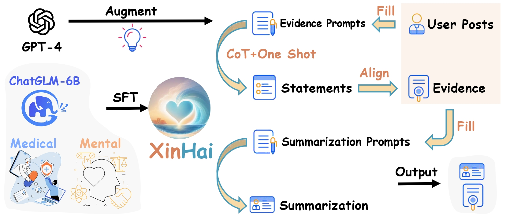

# XinHai at CLPsych2024
Our code for CLPsych 2024 Shared Task Utilising LLMs: Finding supporting evidence about an individual’s suicide risk level

## Methodology
Our system integrates fine-tuned LLMs, employing Chain of Thought and one-shot learning techniques to enhance the model's ability to extract and summarize relevant evidence. For details on our methodology, refer to our model pipeline diagram. 


## Installation and Usage
For a comprehensive guide on deploying and utilizing the XinHai system, including specific prompts and fine-tuning tricks outlined in our research, clone this repository and consult our code. This includes:
- Example prompts used for model training and inference
- Fine-tuning techniques and optimization tricks for improved model performance

```shell
git clone https://github.com/CAS-SIAT-XinHai/XinHai-at-CLPsych2024.git
cd XinHai-at-CLPsych2024/src
```
## Citation
If you use XinHai at CLPsych2024 in your research, please cite our work using the following BibTeX entry:

```bibtex
@inproceedings{xinhai-clpsych2024,
  title={{XinHai@CLPsych 2024 Shared Task: Prompting Healthcare-oriented LLMs for Evidence Highlighting in Posts with Suicide Risk}},
  author={Jingwei Zhu and Ancheng Xu and Minghuan Tan and Min Yang},
  booktitle={Proceedings of the CLPsych 2024 Shared Task},
  year={2024}
}
```

## Acknowledgement
- The XinHai logo and banner are generated using Stable-Diffusion-XL hosted by [Qianfan](https://cloud.baidu.com/product/wenxinworkshop?track=product) from Baidu with the prompt `logo design, heart, ocean, calm, peace, clean, light blue sea, warm sky,no human, no island, psychology conseling, empathy, relaxing, meditation, circle`
- Interactive testing recommended with [LangChain-Chatchat](https://github.com/chatchat-space/Langchain-Chatchat).
- SFT powered by [LLaMA-Factory](https://github.com/hiyouga/LLaMA-Factory).
